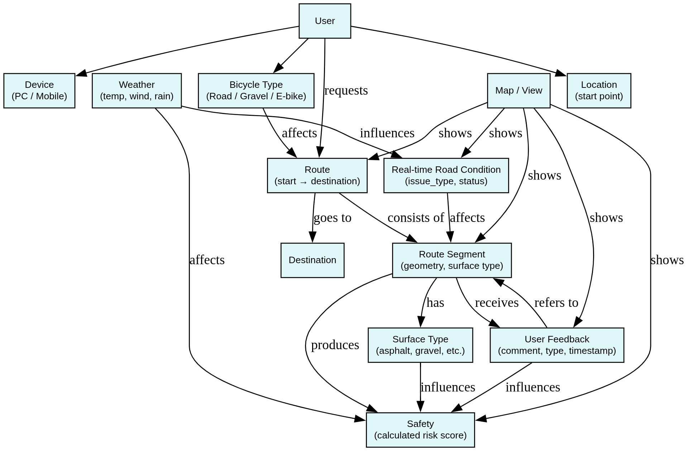
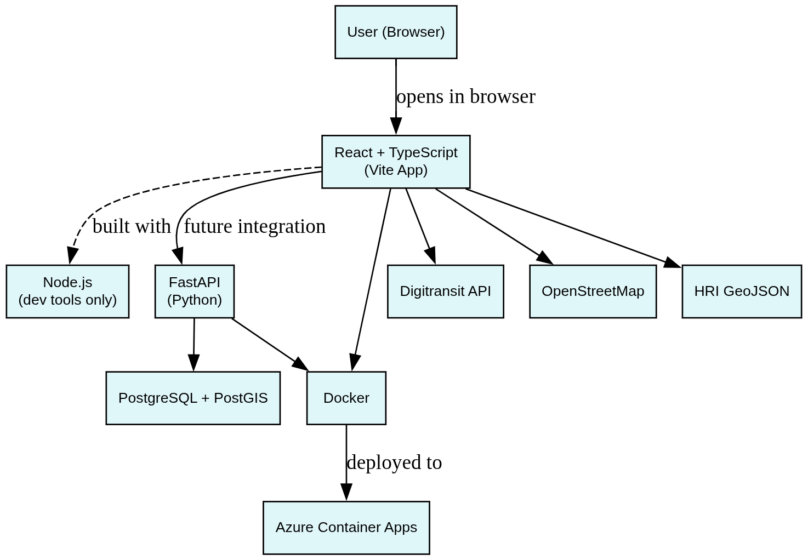

# bike-route-map

A web application that helps cyclists find safer and more comfortable bike routes,  
with surface type visualization and smart routing using open data.

---

## 1. Features

- Surface type map (asphalt, gravel, cobblestone, etc.)
- Route planning between A → B (via Digitransit API)
- Route surface type breakdown (percentages)
- (Optional) User feedback for segments

---

## 2. Tech Stack

- **Frontend:** React + Leaflet + Vite  
- **Backend:** FastAPI (Python) — *(planned, placeholder in /backend)*  
- **Database:** PostgreSQL + PostGIS — *(planned)*  
- **GIS:** Location and surface data via GeoJSON, ORS API, Overpass API  
- **Deployment:** Azure Static Web Apps (current), Docker + Azure Containers *(planned)*

---

## 3. How to Run

### Frontend

```bash
# install dependencies
npm install

# start the development server (http://localhost:5173)
npm run dev

# build the production bundle
npm run build

# preview the production build locally
npm run preview
```

### Backend (optional / FastAPI placeholder)

```
# create and activate virtual environment
python3 -m venv venv
source venv/bin/activate   # Linux / macOS
venv\Scripts\activate      # Windows

# install dependencies
pip install -r requirements.txt

# run the FastAPI server
uvicorn main:app --reload --port 8000
```
> Note: The backend folder currently contains a FastAPI skeleton only.  
> The frontend communicates directly with **ORS (OpenRouteService)** and **Overpass API** for routing and surface data.  
> Integration with a custom FastAPI backend and Azure containers is planned for future versions.

---

## 4. Folder Structure

```
/src       → React components, map logic
/public    → Static files (e.g., GeoJSON, favicon)
/backend   → FastAPI placeholder (to be expanded)
/docs      → Diagrams, MVP notes, problem/solution domain docs
```

---

## 5. Docs

- [Problem Domain](docs/problem_domain.md)
- [Problem Domain Diagram](docs/ProblemDomain.png)
- [Solution Domain](docs/solution_domain.md)
- [MVP Description](docs/mvp.md) 
- [Solution Architecture](docs/TechStack.png)
- [Task List / TODO](TODO.md)

---

## 6. Problem Domain Diagram

> View or edit diagram: [https://is.gd/aFSsrB](https://is.gd/aFSsrB)




## 7. Solution Domain Overview

> View or edit diagram: [https://is.gd/oo5vFi](https://is.gd/oo5vFi)

 

---

## 8. Project Tracker

For full task progress and status, see the  
[GitHub Project Board](https://github.com/users/VoxelPrincess/projects/3/views/1)

---

## PR Preview (Azure SWA)

This project uses **Azure Static Web Apps (SWA)** for pull request previews.  
Each pull request automatically creates a temporary preview environment.  
The preview URL is shown in the PR checks and disappears after the PR is merged.  

For deployment details, see [DEPLOY.md](./DEPLOY.md).

---

## 9. Deployment

### 11.1 — Frontend on Azure Static Web Apps

- **Resource:** `bike-frontend` (Free, Region: West Europe)  
- **Branch:** `main`  
- **App location:** `/` • **Output:** `dist` • **API:** *(empty)*  
- **URL:** https://kind-river-099ad551e.2.azurestaticapps.net  
- **Notes:** SPA fallback via `staticwebapp.config.json` prevents 404 on deep links.

### 11.4 — Test Updates via Pull Request

Updates are tested through **pull requests**.  
Each PR triggers GitHub Actions → Azure SWA builds a **temporary preview environment**.  
The preview URL is shown in the PR checks and disappears after the PR is merged.

👉 For full deployment details, see [DEPLOY.md](./DEPLOY.md).
